# Shoes Store — Grafo de Trazabilidad del Proyecto

> **Versión:** 1.3.0
> **Propósito:** Este documento es el "cerebro" estructurado del proyecto. Cualquier agente de código debe consultarlo **antes** de actuar y actualizarlo **después** de cualquier cambio que modifique la arquitectura, dependencias, modelos, rutas o convenciones.

---

## 1. Visión general del grafo

Este grafo representa:

- Los componentes del proyecto (archivos, módulos, modelos).
- Las dependencias entre ellos.
- La superficie de la API REST.
- El modelo de datos.
- Las convenciones vigentes.
- Los problemas conocidos que deben respetarse o corregirse.
- Las reglas de oro para agentes.

---

## 2. Diagrama de arquitectura (Mermaid)

```mermaid
flowchart TD
    subgraph Infraestructura
        A[package.json]
        B[tsconfig.json]
        C[.env]
    end

    subgraph Entrada
        D[src/server.ts]
        E[src/app.ts]
        Seed[src/seedAdmin.ts]
    end

    subgraph Base_de_datos
        F[src/app/database/connection.ts]
    end

    subgraph Middleware
        Mw[src/app/middleware/auth.ts]
    end

    subgraph Capa_Modelo
        G[src/app/models/CategoryModel.ts]
        H[src/app/models/ProductModel.ts]
        U[src/app/models/UserModel.ts]
        S[src/app/models/SaleModel.ts]
        Im[src/app/models/InventoryMovementModel.ts]
    end

    subgraph Capa_Repositorio
        I[src/app/repositories/CategoryRepository.ts]
        J[src/app/repositories/ProductRepository.ts]
        Ur[src/app/repositories/UserRepository.ts]
        Sr[src/app/repositories/SaleRepository.ts]
        Imr[src/app/repositories/InventoryMovementRepository.ts]
    end

    subgraph Capa_Servicio
        K[src/app/services/CategoryService.ts]
        L[src/app/services/ProductService.ts]
        Us[src/app/services/UserService.ts]
        Ss[src/app/services/SaleService.ts]
        Ims[src/app/services/InventoryMovementService.ts]
        As[src/app/services/AuthService.ts]
    end

    subgraph Capa_Controller
        Mc[src/app/controllers/CategoryController.ts]
        Pc[src/app/controllers/ProductController.ts]
        Uc[src/app/controllers/UserController.ts]
        Sc[src/app/controllers/SaleController.ts]
        Imc[src/app/controllers/InventoryMovementController.ts]
        Ac[src/app/controllers/AuthController.ts]
    end

    subgraph Rutas
        Mr[src/app/routes/CategoryRoutes.ts]
        Pr[src/app/routes/ProductRoutes.ts]
        Urts[src/app/routes/UserRoutes.ts]
        Srts[src/app/routes/SaleRoutes.ts]
        Imrts[src/app/routes/InventoryMovementRoutes.ts]
        Arts[src/app/routes/AuthRoutes.ts]
    end

    subgraph API
        Q[/api/v1/auth/login\]
        Reg[/api/v1/auth/register\]
        R[/api/v1/categories\]
        T[/api/v1/products\]
        T2[/api/v1/products/:id\]
        Uapi[/api/v1/users\]
        Sapi[/api/v1/sales\]
        Imapi[/api/v1/inventory-movements\]
    end

    A -->|start / dev / build| D
    Seed -->|importa| F
    Seed -->|usa| U
    D -->|importa| E
    D -->|importa| F
    E -->|mount| Arts
    E -->|mount| Mr
    E -->|mount| Pr
    E -->|mount| Urts
    E -->|mount| Srts
    E -->|mount| Imrts

    Arts -->|login| Ac
    Arts -->|register| Ac
    Mr -->|admin| Mw --> Mc
    Mr -->|public| Mc
    Pr -->|admin| Mw --> Pc
    Pr -->|public| Pc
    Urts -->|usa| Mw --> Uc
    Srts -->|usa| Mw --> Sc
    Imrts -->|admin| Mw --> Imc

    Ac -->|usa| As
    Ac -->|register| Us
    Mc -->|usa| K
    Pc -->|usa| L
    Uc -->|usa| Us
    Sc -->|usa| Ss
    Imc -->|usa| Ims

    As -->|usa| Ur
    K -->|usa| I
    L -->|usa| J
    Us -->|usa| Ur
    Ss -->|usa| Sr
    Ss -->|usa| J
    Ss -->|usa| Ims
    Ims -->|usa| Imr
    Ims -->|usa| H

    I -->|usa| G
    J -->|usa| H
    Ur -->|usa| U
    Sr -->|usa| S
    Imr -->|usa| Im

    H -->|refiere a| G
    S -->|refiere a| U
    Im -->|refiere a| H
    Im -->|refiere a| U
    Im -->|refiere a| S

    Arts -->|expone| Q
    Arts -->|expone| Reg
    Mr -->|expone| R
    Pr -->|expone| T
    Pr -->|expone| T2
    Urts -->|expone| Uapi
    Srts -->|expone| Sapi
    Imrts -->|expone| Imapi
```



---

## 3. Superficie de la API

Base URL: `/api/v1`

### 3.1 Autenticación (público)

| Método | Ruta | Auth | Descripción |
|--------|------|------|-------------|
| POST | `/auth/register` | No | Registro de cliente (`customer`). |
| POST | `/auth/login` | No | Inicio de sesión. |

### 3.2 Usuarios

| Método | Ruta | Auth | Roles | Descripción |
|--------|------|------|-------|-------------|
| POST | `/users` | Sí | admin | Crear usuario. |
| GET | `/users` | Sí | admin | Listar usuarios activos. |
| GET | `/users/:id` | Sí | cualquiera | Ver usuario. Admin puede ver cualquiera; customer solo el propio (lógica en controller). |
| PUT | `/users/:id` | Sí | propio/admin | Editar perfil propio. Admin puede editar cualquiera. |
| DELETE | `/users/:id` | Sí | admin | Desactivar usuario (soft delete). |

### 3.3 Categorías

| Método | Ruta | Auth | Roles | Descripción |
|--------|------|------|-------|-------------|
| POST | `/categories` | Sí | admin | Crear categoría. |
| GET | `/categories` | No | — | Listar categorías activas. |
| GET | `/categories/:id` | No | — | Obtener categoría. |
| PUT | `/categories/:id` | Sí | admin | Actualizar categoría. |
| DELETE | `/categories/:id` | Sí | admin | Soft delete. |

### 3.4 Productos

| Método | Ruta | Auth | Roles | Descripción |
|--------|------|------|-------|-------------|
| GET | `/products` | No | — | Listar productos. |
| GET | `/products/:id` | No | — | Obtener producto por ID. |
| POST | `/products` | Sí | admin | Crear producto. |
| PUT | `/products/:id` | Sí | admin | Actualizar producto. |
| DELETE | `/products/:id` | Sí | admin | Hard delete. |

### 3.5 Ventas (compras)

| Método | Ruta | Auth | Roles | Descripción |
|--------|------|------|-------|-------------|
| POST | `/sales` | Sí | customer/admin | Crear compra. |
| GET | `/sales` | Sí | customer/admin | Customer ve sus compras; admin ve todas. |
| GET | `/sales/:id` | Sí | customer/admin | Customer solo ve ventas propias. |

### 3.6 Movimientos de inventario (admin)

| Método | Ruta | Auth | Roles | Descripción |
|--------|------|------|-------|-------------|
| POST | `/inventory-movements` | Sí | admin | Registrar movimiento. |
| GET | `/inventory-movements` | Sí | admin | Listar movimientos. |
| GET | `/inventory-movements/product/:productId` | Sí | admin | Historial por producto. |

---

## 4. Modelo de datos

### 4.1 User

```typescript
{
  name: string;
  email: string;        // único, indexado por unique
  password: string;       // hash bcrypt
  document: string;       // único, indexado por unique
  phone: string;
  role: 'admin' | 'customer';
  active: boolean;
  createdAt: Date;
  updatedAt: Date;
}
```

### 4.2 Category

```typescript
{
  name: string;
  description: string;
  active: boolean;        // soft delete
  createdAt: Date;
  updatedAt: Date;
}
```

### 4.3 Product

```typescript
{
  name: string;
  brand: string;
  category: ObjectId;   // ref Category, indexado
  description: string;
  purchasePrice: number;  // precio de compra
  price: number;          // precio de venta
  active: boolean;        // indexado
  images: string[];
  variants: [
    { size: number; color: string; stock: number; }
  ];
  createdAt: Date;
  updatedAt: Date;
}
```

### 4.4 Sale

```typescript
{
  customer: ObjectId;     // ref User (customer)
  createdBy: ObjectId;    // ref User (quien registró la compra)
  date: Date;
  items: [
    {
      product: ObjectId;
      nameSnapshot: string;  // nombre al momento de la compra
      size: number;
      color: string;
      quantity: number;
      unitPrice: number;
      subtotal: number;
    }
  ];
  discount: number;
  total: number;
  paymentMethod: 'cash' | 'card' | 'transfer';
  createdAt: Date;
  updatedAt: Date;
}
```

### 4.5 InventoryMovement

```typescript
{
  product: ObjectId;      // ref Product
  type: 'entry' | 'exit' | 'adjustment';
  size: number;
  color: string;
  quantity: number;
  reason?: string;
  user: ObjectId;         // ref User (admin)
  sale?: ObjectId;        // ref Sale, opcional
  createdAt: Date;
  updatedAt: Date;
}
```

---

## 5. Convenciones vigentes

1. **Idioma del código:** inglés para archivos, variables, clases y funciones.
2. **Idioma de negocio/documentación:** español.
3. **Interfaces Mongoose:** prefijo `I` (`IUser`, `IProduct`, `IProductVariant`).
4. **Modelos:** exportados como `ModelName`.
5. **Singletons:** repositorios y servicios se exportan como instancias.
6. **Estructura de capas:** `model → repository → service → controller → routes`.
7. **Estilo de controller preferido:** clase + instancia singleton (`CategoryController`).
8. **Prefijo de API:** `/api/v1/` para todas las rutas.
9. **Autenticación:** JWT en header `Authorization: Bearer <token>`.
10. **Roles:** `admin` (gestión total) y `customer` (catálogo + compras).
11. **Catálogo público:** `GET /products`, `GET /products/:id` y `GET /categories` sin autenticación.
12. **Registro público:** `POST /auth/register` crea `customer`.
13. **No exponer `password`** en respuestas de usuarios.

---

## 6. Problemas conocidos

| ID | Severidad | Problema | Ubicación |
|----|-----------|----------|-----------|
| ISSUE-003 | Baja | Dos estilos de controllers coexisten. `ProductController` sigue usando funciones exportadas sueltas; debería migrarse a clase + singleton para homogeneidad. | `src/app/controllers/` |
| ISSUE-004 | Baja | Política de eliminación inconsistente: categorías/usuarios soft delete, productos hard delete. | `src/app/repositories/` |
| ISSUE-005 | Media | Sin validación explícita de entrada más allá de Mongoose. | `src/app/services/` |
| ISSUE-007 | Baja | Sin middleware centralizado de errores. | `src/app/controllers/` |
| ISSUE-008 | Baja | Sin tests. | `package.json` |

### Problemas resueltos recientemente

| ID | Descripción |
|----|-------------|
| ISSUE-001 | `package.json` start corregido a `dist/server.js`. |
| ISSUE-002 | Todas las rutas unificadas bajo `/api/v1/`. |
| ISSUE-006 | Autenticación JWT con roles `admin` y `customer`, registro público y seed de admin implementados. |
| ISSUE-009 | Versiones inválidas en `package.json` corregidas (Express 4.x, Mongoose 8.x, TypeScript 5.x, dotenv 16.x). |
| ISSUE-010 | `ProductModel` exporta correctamente el modelo e `IProductVariant`; índices duplicados en `UserModel` eliminados. |
| ISSUE-011 | `CategoryRoutes` y `ProductRoutes` protegidas con auth/roles; `GET /products/:id` agregado al catálogo público. |

---

## 7. Reglas de oro para agentes

1. **ANTES de actuar**, leer `.agents/project-graph.json` y `.agents/project-graph.md`.
2. **DESPUÉS de cualquier cambio** que afecte arquitectura, dependencias, modelos, rutas o convenciones, actualizar ambos archivos del grafo.
3. No agregar dependencias sin justificación y sin verificar compatibilidad con el stack actual.
4. Respetar la estructura de capas; no saltar de controller a repositorio directamente.
5. Para nuevos dominios, usar el estilo de `CategoryController` (clase + singleton).
6. Ejecutar `npm run build` antes de finalizar cambios significativos.
7. No exponer `.env` ni credenciales.

---

## 8. Siguientes pasos sugeridos

1. Migrar `ProductController` a clase + singleton y homogeneizar respuestas.
2. Homogeneizar políticas de eliminación (recomendado soft delete para todo).
3. Agregar validación de entrada con Zod o Joi.
4. Implementar middleware centralizado de errores.
5. Crear módulo de reportes (ventas del día/mes, productos más vendidos, ganancias, inventario bajo).
6. Agregar paginación en listados.
7. Agregar tests automatizados.
