# Shoes Store — Grafo de Trazabilidad del Proyecto

> **Versión:** 2.0.0
> **Propósito:** Este documento es el "cerebro" estructurado del proyecto. Cualquier agente de código debe consultarlo **antes** de actuar y actualizarlo **después** de cualquier cambio que modifique la arquitectura, dependencias, modelos, rutas o convenciones.

---

## 1. Visión general del grafo

Este proyecto ahora es un **monorepo** que contiene:

- **backend**: API REST con Express + TypeScript + Mongoose (proyecto original).
- **frontend**: Aplicación React + TypeScript + Vite que consume la API.

El grafo representa:

- Los componentes del proyecto (archivos, módulos, modelos).
- Las dependencias entre ellos.
- La superficie de la API REST.
- El modelo de datos.
- Las convenciones vigentes.
- Los problemas conocidos que deben respetarse o corregirse.
- Las reglas de oro para agentes.

---

## 2. Diagrama de arquitectura (Mermaid)

```mermaid
flowchart TD
    subgraph Monorepo
        RootPkg[package.json]
        RootIgnore[.gitignore]
        RootReadme[README.md]
    end

    subgraph Backend
        subgraph Infraestructura_BE
            A[backend/package.json]
            B[backend/tsconfig.json]
            C[backend/.env]
        end

        subgraph Entrada_BE
            D[backend/src/server.ts]
            E[backend/src/app.ts]
            Seed[backend/src/seedAdmin.ts]
        end

        subgraph Base_de_datos
            F[backend/src/app/database/connection.ts]
        end

        subgraph Middleware
            Mw[backend/src/app/middleware/auth.ts]
        end

        subgraph Capa_Modelo
            G[backend/src/app/models/CategoryModel.ts]
            H[backend/src/app/models/ProductModel.ts]
            U[backend/src/app/models/UserModel.ts]
            S[backend/src/app/models/SaleModel.ts]
            Im[backend/src/app/models/InventoryMovementModel.ts]
        end

        subgraph Capa_Repositorio
            I[backend/src/app/repositories/CategoryRepository.ts]
            J[backend/src/app/repositories/ProductRepository.ts]
            Ur[backend/src/app/repositories/UserRepository.ts]
            Sr[backend/src/app/repositories/SaleRepository.ts]
            Imr[backend/src/app/repositories/InventoryMovementRepository.ts]
        end

        subgraph Capa_Servicio
            K[backend/src/app/services/CategoryService.ts]
            L[backend/src/app/services/ProductService.ts]
            Us[backend/src/app/services/UserService.ts]
            Ss[backend/src/app/services/SaleService.ts]
            Ims[backend/src/app/services/InventoryMovementService.ts]
            As[backend/src/app/services/AuthService.ts]
        end

        subgraph Capa_Controller
            Mc[backend/src/app/controllers/CategoryController.ts]
            Pc[backend/src/app/controllers/ProductController.ts]
            Uc[backend/src/app/controllers/UserController.ts]
            Sc[backend/src/app/controllers/SaleController.ts]
            Imc[backend/src/app/controllers/InventoryMovementController.ts]
            Ac[backend/src/app/controllers/AuthController.ts]
        end

        subgraph Rutas_BE
            Mr[backend/src/app/routes/CategoryRoutes.ts]
            Pr[backend/src/app/routes/ProductRoutes.ts]
            Urts[backend/src/app/routes/UserRoutes.ts]
            Srts[backend/src/app/routes/SaleRoutes.ts]
            Imrts[backend/src/app/routes/InventoryMovementRoutes.ts]
            Arts[backend/src/app/routes/AuthRoutes.ts]
        end
    end

    subgraph Frontend
        subgraph Infraestructura_FE
            PkgFE[frontend/package.json]
            TsFE[frontend/tsconfig.app.json]
            ViteFE[frontend/vite.config.ts]
        end

        subgraph API_Client
            ApiClient[frontend/src/api/client.ts]
        end

        subgraph Shared_UI
            Layout[frontend/src/components/Layout.tsx]
            Navbar[frontend/src/components/Navbar.tsx]
            PrivateRoute[frontend/src/components/PrivateRoute.tsx]
            AdminRoute[frontend/src/components/AdminRoute.tsx]
        end

        subgraph Auth_FE
            AuthCtx[frontend/src/features/auth/context/AuthContext.tsx]
            LoginPage[frontend/src/features/auth/pages/LoginPage.tsx]
            RegisterPage[frontend/src/features/auth/pages/RegisterPage.tsx]
        end

        subgraph Landing_FE
            LandingPage[frontend/src/features/landing/pages/LandingPage.tsx]
            Hero[frontend/src/features/landing/components/HeroSection.tsx]
            CategoryShowcase[frontend/src/features/landing/components/CategoryShowcase.tsx]
            FeaturedProducts[frontend/src/features/landing/components/FeaturedProducts.tsx]
            Stats[frontend/src/features/landing/components/StatsSection.tsx]
            Promo[frontend/src/features/landing/components/PromoBanner.tsx]
            Testimonials[frontend/src/features/landing/components/TestimonialsCarousel.tsx]
            Benefits[frontend/src/features/landing/components/BenefitsSection.tsx]
            Newsletter[frontend/src/features/landing/components/NewsletterSection.tsx]
            LandingHooks[frontend/src/features/landing/hooks/useInView.ts]
            LandingData[frontend/src/features/landing/data/images.ts]
        end

        subgraph Catalog_FE
            Catalog[frontend/src/features/catalog/pages/CatalogPage.tsx]
            ProductDetail[frontend/src/features/catalog/pages/ProductDetailPage.tsx]
            ProductCard[frontend/src/features/catalog/components/ProductCard.tsx]
        end

        subgraph Cart_FE
            CartCtx[frontend/src/features/cart/context/CartContext.tsx]
            CartPage[frontend/src/features/cart/pages/CartPage.tsx]
        end

        subgraph Sales_FE
            Checkout[frontend/src/features/sales/pages/CheckoutPage.tsx]
            Orders[frontend/src/features/sales/pages/OrdersPage.tsx]
        end

        subgraph Admin_FE
            AdminDash[frontend/src/features/admin/pages/AdminDashboardPage.tsx]
            AdminProducts[frontend/src/features/admin/pages/AdminProductsPage.tsx]
            AdminCategories[frontend/src/features/admin/pages/AdminCategoriesPage.tsx]
            AdminUsers[frontend/src/features/admin/pages/AdminUsersPage.tsx]
            AdminSales[frontend/src/features/admin/pages/AdminSalesPage.tsx]
            AdminInventory[frontend/src/features/admin/pages/AdminInventoryPage.tsx]
        end

        Router[frontend/src/App.tsx]
    end

    subgraph API
        Q[/api/v1/auth/login\]
        Reg[/api/v1/auth/register\]
        R[/api/v1/categories\]
        T[/api/v1/products\]
        T2[/api/v1/products/:id\]
        Uapi[/api/v1/users\]
        Sapi[/api/v1/sales\]
        Imapi[/api/v1/inventory-movements\]
    end

    RootPkg -->|workspaces| A
    RootPkg -->|workspaces| PkgFE

    A -->|start / dev / build| D
    Seed -->|importa| F
    Seed -->|usa| U
    D -->|importa| E
    D -->|importa| F
    E -->|mount| Arts
    E -->|mount| Mr
    E -->|mount| Pr
    E -->|mount| Urts
    E -->|mount| Srts
    E -->|mount| Imrts

    Arts -->|login| Ac
    Arts -->|register| Ac
    Mr -->|admin| Mw --> Mc
    Mr -->|public| Mc
    Pr -->|admin| Mw --> Pc
    Pr -->|public| Pc
    Urts -->|usa| Mw --> Uc
    Srts -->|usa| Mw --> Sc
    Imrts -->|admin| Mw --> Imc

    Ac -->|usa| As
    Ac -->|register| Us
    Mc -->|usa| K
    Pc -->|usa| L
    Uc -->|usa| Us
    Sc -->|usa| Ss
    Imc -->|usa| Ims

    As -->|usa| Ur
    K -->|usa| I
    L -->|usa| J
    Us -->|usa| Ur
    Ss -->|usa| Sr
    Ss -->|usa| J
    Ss -->|usa| Ims
    Ims -->|usa| Imr
    Ims -->|usa| H

    I -->|usa| G
    J -->|usa| H
    Ur -->|usa| U
    Sr -->|usa| S
    Imr -->|usa| Im

    H -->|refiere a| G
    S -->|refiere a| U
    Im -->|refiere a| H
    Im -->|refiere a| U
    Im -->|refiere a| S

    Arts -->|expone| Q
    Arts -->|expone| Reg
    Mr -->|expone| R
    Pr -->|expone| T
    Pr -->|expone| T2
    Urts -->|expone| Uapi
    Srts -->|expone| Sapi
    Imrts -->|expone| Imapi

    ApiClient -->|consume| Q
    ApiClient -->|consume| Reg
    ApiClient -->|consume| R
    ApiClient -->|consume| T
    ApiClient -->|consume| T2
    ApiClient -->|consume| Uapi
    ApiClient -->|consume| Sapi
    ApiClient -->|consume| Imapi

    Router -->|render| Layout
    Router -->|render| Navbar
    Router -->|render| LandingPage
    Router -->|render| PrivateRoute
    Router -->|render| AdminRoute
    Router -->|render| LoginPage
    Router -->|render| RegisterPage
    Router -->|render| Catalog

    LandingPage -->|render| Hero
    LandingPage -->|render| CategoryShowcase
    LandingPage -->|render| FeaturedProducts
    LandingPage -->|render| Stats
    LandingPage -->|render| Promo
    LandingPage -->|render| Testimonials
    LandingPage -->|render| Benefits
    LandingPage -->|render| Newsletter
    LandingPage -->|usa| LandingHooks
    LandingPage -->|usa| LandingData
    FeaturedProducts -->|render| ProductCard
    Router -->|render| ProductDetail
    Router -->|render| CartPage
    Router -->|render| Checkout
    Router -->|render| Orders
    Router -->|render| AdminDash
    Router -->|render| AdminProducts
    Router -->|render| AdminCategories
    Router -->|render| AdminUsers
    Router -->|render| AdminSales
    Router -->|render| AdminInventory

    AuthCtx -->|provee| LoginPage
    AuthCtx -->|provee| RegisterPage
    AuthCtx -->|provee| PrivateRoute
    AuthCtx -->|provee| AdminRoute
    CartCtx -->|provee| Catalog
    CartCtx -->|provee| CartPage
    CartCtx -->|provee| Checkout
```



---

## 3. Estructura del monorepo

```text
/
├── backend/                        # API REST existente
│   ├── src/
│   │   ├── app.ts                  # Configura Express + CORS + rutas
│   │   ├── seedAdmin.ts            # Crea el primer administrador
│   │   ├── server.ts               # Inicia el servidor y conecta MongoDB
│   │   └── app/
│   │       ├── controllers/        # Manejadores HTTP
│   │       ├── database/connection.ts
│   │       ├── middleware/auth.ts
│   │       ├── models/             # Esquemas Mongoose
│   │       ├── repositories/       # Acceso a datos
│   │       ├── routes/             # Rutas Express
│   │       └── services/           # Lógica de negocio
│   ├── dist/                       # Salida de tsc
│   ├── data/                       # Datos locales (MongoDB)
│   ├── docs/                       # Documentación del backend
│   ├── package.json
│   ├── tsconfig.json
│   └── .env.example
├── frontend/                       # Aplicación React
│   ├── src/
│   │   ├── api/                    # Cliente Axios + wrappers
│   │   ├── components/             # UI compartida
│   │   ├── features/               # Dominios por funcionalidad
│   │   │   ├── auth/
│   │   │   ├── catalog/
│   │   │   ├── cart/
│   │   │   ├── sales/
│   │   │   ├── admin/
│   │   │   └── landing/            # Página de inicio, componentes, hooks y assets
│   │   ├── types/                  # Tipos compartidos
│   │   ├── utils/                  # Helpers
│   │   ├── App.tsx                 # Router principal
│   │   └── main.tsx                # Punto de entrada
│   ├── package.json
│   ├── tsconfig.app.json
│   └── vite.config.ts
├── package.json                    # npm workspaces
├── .gitignore
└── README.md
```

---

## 4. Superficie de la API

Base URL: `/api/v1`

### 4.1 Autenticación (público)

| Método | Ruta | Auth | Descripción |
|--------|------|------|-------------|
| POST | `/auth/register` | No | Registro de cliente (`customer`). |
| POST | `/auth/login` | No | Inicio de sesión. |

### 4.2 Usuarios

| Método | Ruta | Auth | Roles | Descripción |
|--------|------|------|-------|-------------|
| POST | `/users` | Sí | admin | Crear usuario. |
| GET | `/users` | Sí | admin | Listar usuarios activos. |
| GET | `/users/:id` | Sí | cualquiera | Ver usuario. Admin puede ver cualquiera; customer solo el propio. |
| PUT | `/users/:id` | Sí | propio/admin | Editar perfil propio. Admin puede editar cualquiera. |
| DELETE | `/users/:id` | Sí | admin | Desactivar usuario (soft delete). |

### 4.3 Categorías

| Método | Ruta | Auth | Roles | Descripción |
|--------|------|------|-------|-------------|
| POST | `/categories` | Sí | admin | Crear categoría. |
| GET | `/categories` | No | — | Listar categorías activas. |
| GET | `/categories/:id` | No | — | Obtener categoría. |
| PUT | `/categories/:id` | Sí | admin | Actualizar categoría. |
| DELETE | `/categories/:id` | Sí | admin | Soft delete. |

### 4.4 Productos

| Método | Ruta | Auth | Roles | Descripción |
|--------|------|------|-------|-------------|
| GET | `/products` | No | — | Listar productos. |
| GET | `/products/:id` | No | — | Obtener producto por ID. |
| POST | `/products` | Sí | admin | Crear producto. |
| PUT | `/products/:id` | Sí | admin | Actualizar producto. |
| DELETE | `/products/:id` | Sí | admin | Hard delete. |

### 4.5 Ventas (compras)

| Método | Ruta | Auth | Roles | Descripción |
|--------|------|------|-------|-------------|
| POST | `/sales` | Sí | customer/admin | Crear compra. |
| GET | `/sales` | Sí | customer/admin | Customer ve sus compras; admin ve todas. |
| GET | `/sales/:id` | Sí | customer/admin | Customer solo ve ventas propias. |

### 4.6 Movimientos de inventario (admin)

| Método | Ruta | Auth | Roles | Descripción |
|--------|------|------|-------|-------------|
| POST | `/inventory-movements` | Sí | admin | Registrar movimiento. |
| GET | `/inventory-movements` | Sí | admin | Listar movimientos. |
| GET | `/inventory-movements/product/:productId` | Sí | admin | Historial por producto. |

---

## 5. Modelo de datos

### 5.1 User

```typescript
{
  name: string;
  email: string;        // único, indexado por unique
  password: string;       // hash bcrypt
  document: string;       // único, indexado por unique
  phone: string;
  role: 'admin' | 'customer';
  active: boolean;
  createdAt: Date;
  updatedAt: Date;
}
```

### 5.2 Category

```typescript
{
  name: string;
  description: string;
  active: boolean;        // soft delete
  createdAt: Date;
  updatedAt: Date;
}
```

### 5.3 Product

```typescript
{
  name: string;
  brand: string;
  category: ObjectId;   // ref Category, indexado
  description: string;
  purchasePrice: number;  // precio de compra
  price: number;          // precio de venta
  active: boolean;        // indexado
  images: string[];
  variants: [
    { size: number; color: string; stock: number; }
  ];
  createdAt: Date;
  updatedAt: Date;
}
```

### 5.4 Sale

```typescript
{
  customer: ObjectId;     // ref User (customer)
  createdBy: ObjectId;  // ref User (quien registró la compra)
  date: Date;
  items: [
    {
      product: ObjectId;
      nameSnapshot: string;  // nombre al momento de la compra
      size: number;
      color: string;
      quantity: number;
      unitPrice: number;
      subtotal: number;
    }
  ];
  discount: number;
  total: number;
  paymentMethod: 'cash' | 'card' | 'transfer';
  createdAt: Date;
  updatedAt: Date;
}
```

### 5.5 InventoryMovement

```typescript
{
  product: ObjectId;      // ref Product
  type: 'entry' | 'exit' | 'adjustment';
  size: number;
  color: string;
  quantity: number;
  reason?: string;
  user: ObjectId;         // ref User (admin)
  sale?: ObjectId;        // ref Sale, opcional
  createdAt: Date;
  updatedAt: Date;
}
```

---

## 6. Stack tecnológico

| Capa | Tecnología |
| --- | --- |
| **Backend** | TypeScript 5.x, Express 4.x, Mongoose 8.x, JWT + bcryptjs |
| **Frontend** | React 19, TypeScript, Vite 8, React Router DOM 7, Axios, lucide-react |
| **Base de datos** | MongoDB |
| **Workspace** | npm workspaces |
| **Autenticación** | JWT Bearer, almacenado en localStorage |

---

## 7. Convenciones vigentes

### Backend

1. **Idioma del código:** inglés para archivos, variables, clases y funciones.
2. **Idioma de negocio/documentación:** español.
3. **Interfaces Mongoose:** prefijo `I` (`IUser`, `IProduct`, `IProductVariant`).
4. **Modelos:** exportados como `ModelName`.
5. **Singletons:** repositorios y servicios se exportan como instancias.
6. **Estructura de capas:** `model → repository → service → controller → routes`.
7. **Estilo de controller preferido:** clase + instancia singleton (`CategoryController`).
8. **Prefijo de API:** `/api/v1/` para todas las rutas.
9. **Autenticación:** JWT en header `Authorization: Bearer <token>`.
10. **Roles:** `admin` (gestión total) y `customer` (catálogo + compras).
11. **Catálogo público:** `GET /products`, `GET /products/:id` y `GET /categories` sin autenticación.
12. **Registro público:** `POST /auth/register` crea `customer`.
13. **No exponer `password`** en respuestas de usuarios.
14. **CORS habilitado** para integración con el frontend (`FRONTEND_URL` opcional).

### Frontend

1. **Idioma del código:** inglés para archivos, variables, clases y funciones.
2. **Idioma de UI:** español.
3. **Estructura por funcionalidades (feature-based):** cada feature agrupa componentes, páginas, hooks y servicios.
4. **Path alias `@/`** apunta a `frontend/src/`.
5. **Cliente API centralizado** en `frontend/src/api/client.ts` con interceptor de autenticación.
6. **Estado global mínimo:** Context API para auth y cart.
7. **Iconografía:** usar `lucide-react` para todos los iconos; evitar SVG inline.
8. **No duplicar lógica de negocio** del backend; el frontend solo presenta y consume la API.

---

## 8. Problemas conocidos

| ID | Severidad | Problema | Ubicación |
|----|-----------|----------|-----------|
| ISSUE-003 | Baja | Dos estilos de controllers coexisten. `ProductController` sigue usando funciones exportadas sueltas; debería migrarse a clase + singleton para homogeneidad. | `backend/src/app/controllers/` |
| ISSUE-004 | Baja | Política de eliminación inconsistente: categorías/usuarios soft delete, productos hard delete. | `backend/src/app/repositories/` |
| ISSUE-005 | Media | Sin validación explícita de entrada más allá de Mongoose. | `backend/src/app/services/` |
| ISSUE-007 | Baja | Sin middleware centralizado de errores. | `backend/src/app/controllers/` |
| ISSUE-008 | Baja | Sin tests. | `backend/package.json` |
| ISSUE-012 | Baja | Frontend usa TypeScript 6 con la opción `ignoreDeprecations` para evitar advertencias de `baseUrl`. Considerar alinear a TypeScript 5.x con el backend. | `frontend/tsconfig.app.json` |
| ISSUE-013 | Baja | Sin tests automatizados en el frontend. | `frontend/package.json` |

### Problemas resueltos recientemente

| ID | Descripción |
|----|-------------|
| ISSUE-001 | `package.json` start corregido a `dist/server.js`. |
| ISSUE-002 | Todas las rutas unificadas bajo `/api/v1/`. |
| ISSUE-006 | Autenticación JWT con roles `admin` y `customer`, registro público y seed de admin implementados. |
| ISSUE-009 | Versiones inválidas en `package.json` corregidas (Express 4.x, Mongoose 8.x, TypeScript 5.x, dotenv 16.x). |
| ISSUE-010 | `ProductModel` exporta correctamente el modelo e `IProductVariant`; índices duplicados en `UserModel` eliminados. |
| ISSUE-011 | `CategoryRoutes` y `ProductRoutes` protegidas con auth/roles; `GET /products/:id` agregado al catálogo público. |
| ISSUE-014 | Monorepo creado con backend/ y frontend/. CORS agregado al backend para permitir la integración. |

---

## 9. Reglas de oro para agentes

1. **ANTES de actuar**, leer `.agents/project-graph.json` y `.agents/project-graph.md`.
2. **DESPUÉS de cualquier cambio** que afecte arquitectura, dependencias, modelos, rutas o convenciones, actualizar ambos archivos del grafo.
3. No agregar dependencias sin justificación y sin verificar compatibilidad con el stack actual.
4. Respetar la estructura de capas del backend; no saltar de controller a repositorio directamente.
5. Para nuevos dominios del backend, usar el estilo de `CategoryController` (clase + singleton).
6. En el frontend, mantener la organización por features y no duplicar lógica de negocio del backend.
7. Ejecutar `npm run build` en ambos workspaces antes de finalizar cambios significativos.
8. No exponer `.env` ni credenciales.

---

## 10. Comandos del monorepo

```bash
# Instalar dependencias de todos los workspaces
npm install

# Desarrollo (backend y frontend en paralelo)
npm run dev

# Build de ambos workspaces
npm run build

# Build individual
npm run build --workspace=backend
npm run build --workspace=frontend

# Iniciar backend compilado
npm run start --workspace=backend

# Seed del administrador
npm run seed:admin --workspace=backend
```

---

## 11. Siguientes pasos sugeridos

1. Migrar `ProductController` a clase + singleton y homogeneizar respuestas.
2. Homogeneizar políticas de eliminación (recomendado soft delete para todo).
3. Agregar validación de entrada con Zod o Joi en el backend.
4. Implementar middleware centralizado de errores en el backend.
5. Crear módulo de reportes en el backend (ventas del día/mes, productos más vendidos, ganancias, inventario bajo).
6. Agregar paginación en listados del backend.
7. Alinear la versión de TypeScript del frontend con la del backend (5.x).
8. Agregar tests automatizados en backend y frontend.
